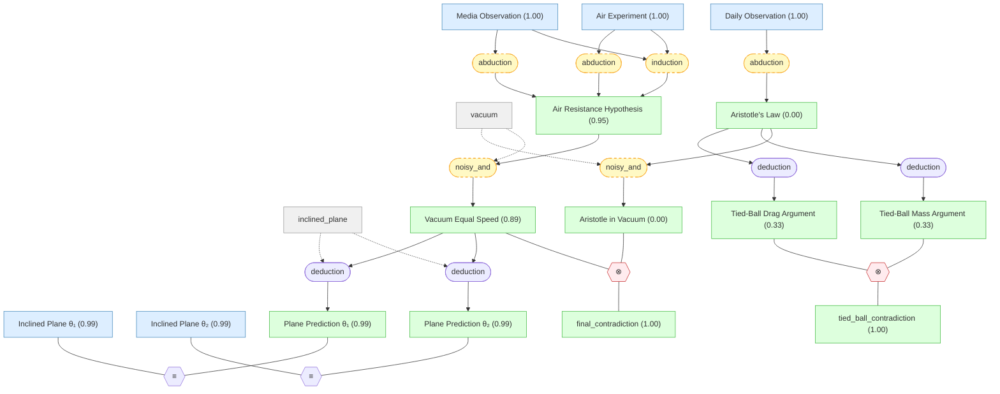

# galileo-falling-bodies-gaia

Galileo's falling bodies argument — Gaia knowledge package

## Overview

## Introduction

#### Air Resistance Hypothesis ★

📌 `hyp_air_resistance`   |   Prior: 0.50   |   Belief: **0.95**

> 不同重量物体的下落速度差异完全由介质阻力造成——阻力是速度差异的唯一原因。阻力越大，差异越大；阻力越小，差异越小。

🔗 **induction**([Media Observation](#obs_media), [Air Experiment](#obs_air))

Reasoning

在不同介质中（@obs_media），介质越稠密速度差异越大、越稀薄差异越小；在空气中（@obs_air），重材料球从 100 腕尺落下速度几乎相同。伽利略由此推断：速度差异完全由介质阻力造成——阻力是差异的唯一原因（@hyp_air_resistance）。此推理为溯因推断：不仅编码了'密度越低差异越小'的相关性，还主张因果机制——阻力决定差异。

#### Vacuum Equal Speed ★

📌 `hyp_vacuum_equal`   |   Prior: 0.50   |   Belief: **0.89**

> 在完全没有阻力的介质（真空）中，不同重量的物体以相同速率下落。

🔗 **noisy_and**([Air Resistance Hypothesis](#hyp_air_resistance))

Reasoning

若阻力是速度差异的唯一原因（@hyp_air_resistance），且真空中阻力为零（@vacuum），则真空中速度差异为零，即不同重量物体等速下落（@hyp_vacuum_equal）。

## Knowledge Graph

## Knowledge Nodes

### Settings

#### inclined_plane

📋 `inclined_plane`

> 伽利略斜面实验装置：12 腕尺长的抛光木条沟槽，衬以光滑羊皮纸，使用坚硬光滑的青铜球——摩擦和空气阻力可忽略，近似纯重力环境。

#### vacuum

📋 `vacuum`

> 真空是完全没有阻力的理想化环境：介质密度为零，唯一作用力为重力。

### Claims

#### Air Experiment

📌 `obs_air`   |   Prior: 0.90   |   Belief: **1.00**

> 在空气中做精细实验：金球、铅球、铜球、斑岩球等重材料球从 100 腕尺高处落下，金球领先铜球不超过四指宽。

#### Daily Observation

📌 `obs_daily`   |   Prior: 0.90   |   Belief: **1.00**

> 日常经验中，较重的物体下落速度确实比较轻的物体快：石头比羽毛快，铁球比木球快。

#### Media Observation

📌 `obs_media`   |   Prior: 0.90   |   Belief: **1.00**

> 在不同密度的介质中比较不同重量物体的下落：介质越稠密（如水银、水、油），轻重物体的速度差异越大；介质越稀薄（如空气），差异越小。在水银中，金是唯一能下沉的物质，其他金属和石头都浮在表面。

#### Inclined Plane θ₁

📌 `obs_theta1`   |   Prior: 0.90   |   Belief: **0.99**

> 斜面实验第一组：在倾角 θ₁ 下，不同重量的光滑青铜球沿抛光沟槽滚下，所经距离之比等于时间之比的平方，与球的重量无关。

#### Inclined Plane θ₂

📌 `obs_theta2`   |   Prior: 0.90   |   Belief: **0.99**

> 斜面实验第二组：在另一倾角 θ₂ 下重复实验，结果一致确认距离 ∝ 时间²，与重量无关。实验重复整整一百次，对所有倾角均成立。

#### Air Resistance Hypothesis ★

📌 `hyp_air_resistance`   |   Prior: 0.50   |   Belief: **0.95**

> 不同重量物体的下落速度差异完全由介质阻力造成——阻力是速度差异的唯一原因。阻力越大，差异越大；阻力越小，差异越小。

🔗 **induction**([Media Observation](#obs_media), [Air Experiment](#obs_air))

Reasoning

在不同介质中（@obs_media），介质越稠密速度差异越大、越稀薄差异越小；在空气中（@obs_air），重材料球从 100 腕尺落下速度几乎相同。伽利略由此推断：速度差异完全由介质阻力造成——阻力是差异的唯一原因（@hyp_air_resistance）。此推理为溯因推断：不仅编码了'密度越低差异越小'的相关性，还主张因果机制——阻力决定差异。

#### Aristotle's Law

📌 `hyp_aristotle`   |   Prior: 0.50   |   Belief: **0.00**

> 物体的下落速度与其重量成正比：一个重量是另一个两倍的物体，通过同样距离所需时间为后者的一半。即重物比轻物下落更快。

🔗 **abduction**([Daily Observation](#obs_daily))

Reasoning

日常经验中（@obs_daily），重的石头比轻的羽毛下落更快，铁球比木球更快。由此推断普遍规律：物体下落速度与重量成正比（@hyp_aristotle）。

#### Aristotle in Vacuum

📌 `hyp_aristotle_vac`   |   Prior: 0.50   |   Belief: **0.00**

> 若物体下落速度与重量成正比是普遍规律，则在真空中也应如此：较重物体在真空中仍比较轻物体下落更快。

🔗 **noisy_and**([Aristotle's Law](#hyp_aristotle))

Reasoning

若亚里士多德定律（@hyp_aristotle）是关于下落速度的普遍规律，将其应用到真空环境（@vacuum）也应成立：在真空中重的物体仍比轻的下落更快（@hyp_aristotle_vac）。

#### Tied-Ball Drag Argument

📌 `hyp_drag`   |   Prior: 0.50   |   Belief: **0.33**

> 在亚里士多德定律下，将重球 H（速度 8）与轻球 L（速度 4）绑在一起，L 对 H 产生拖拽，复合体 HL 的下落速度应小于 H 单独的速度 8。

🔗 **deduction**([Aristotle's Law](#hyp_aristotle))

Reasoning

假设亚里士多德定律（@hyp_aristotle）成立：重物下落更快。将重球 H（速度 8）与轻球 L（速度 4）绑在一起，由于 L 比 H 慢，L 会拖拽 H 使复合体减速，因此复合体 HL 的速度应小于 H 的速度 8（@hyp_drag）。

#### Tied-Ball Mass Argument

📌 `hyp_mass`   |   Prior: 0.50   |   Belief: **0.33**

> 在亚里士多德定律下，复合体 HL 的总重量大于 H 单独的重量，因此按该定律，HL 的下落速度应大于 H 单独的速度 8。

🔗 **deduction**([Aristotle's Law](#hyp_aristotle))

Reasoning

假设亚里士多德定律（@hyp_aristotle）成立：速度与重量成正比。复合体 HL 的总重量 = H + L > H，按该定律，HL 的速度应大于 H 的速度 8（@hyp_mass）。

#### Vacuum Equal Speed ★

📌 `hyp_vacuum_equal`   |   Prior: 0.50   |   Belief: **0.89**

> 在完全没有阻力的介质（真空）中，不同重量的物体以相同速率下落。

🔗 **noisy_and**([Air Resistance Hypothesis](#hyp_air_resistance))

Reasoning

若阻力是速度差异的唯一原因（@hyp_air_resistance），且真空中阻力为零（@vacuum），则真空中速度差异为零，即不同重量物体等速下落（@hyp_vacuum_equal）。

#### final_contradiction

📌 `final_contradiction`   |   Belief: **1.00**

> not_both_true(A, B)

#### Plane Prediction θ₁

📌 `pred_theta1`   |   Prior: 0.50   |   Belief: **0.99**

> 等速假说预测：在近似无摩擦的斜面上（倾角 θ₁），不同重量的球应呈等加速，距离 ∝ 时间²，与重量无关。

🔗 **deduction**([Vacuum Equal Speed](#hyp_vacuum_equal))

Reasoning

若真空中不同重量物体等速下落（@hyp_vacuum_equal），在近似无摩擦的斜面上（@inclined_plane），不同重量的球也应呈等加速（@pred_theta1）。

#### Plane Prediction θ₂

📌 `pred_theta2`   |   Prior: 0.50   |   Belief: **0.99**

> 等速假说预测：在另一倾角（θ₂）的斜面上，同样应呈等加速，距离 ∝ 时间²，与重量无关。

🔗 **deduction**([Vacuum Equal Speed](#hyp_vacuum_equal))

Reasoning

若真空中不同重量物体等速下落（@hyp_vacuum_equal），在另一倾角的斜面上（@inclined_plane），同样应呈等加速（@pred_theta2）。

#### tied_ball_contradiction

📌 `tied_ball_contradiction`   |   Belief: **1.00**

> not_both_true(A, B)

## Inference Results

**BP converged:** True (2 iterations)

| Label | Type | Prior | Belief | Role |
|-------|------|-------|--------|------|
| [hyp_aristotle_vac](#hyp_aristotle_vac) | claim | 0.50 | 0.0004 | derived |
| [hyp_aristotle](#hyp_aristotle) | claim | 0.50 | 0.0005 | derived |
| [hyp_drag](#hyp_drag) | claim | 0.50 | 0.3340 | derived |
| [hyp_mass](#hyp_mass) | claim | 0.50 | 0.3340 | derived |
| [hyp_vacuum_equal](#hyp_vacuum_equal) | claim | 0.50 | 0.8946 | derived |
| [hyp_air_resistance](#hyp_air_resistance) | claim | 0.50 | 0.9531 | derived |
| [obs_theta1](#obs_theta1) | claim | 0.90 | 0.9892 | independent |
| [obs_theta2](#obs_theta2) | claim | 0.90 | 0.9892 | independent |
| [pred_theta1](#pred_theta1) | claim | 0.50 | 0.9892 | derived |
| [pred_theta2](#pred_theta2) | claim | 0.50 | 0.9892 | derived |
| [tied_ball_contradiction](#tied_ball_contradiction) | claim | — | 0.9995 | structural |
| [obs_daily](#obs_daily) | claim | 0.90 | 0.9996 | independent |
| [obs_air](#obs_air) | claim | 0.90 | 0.9999 | independent |
| [obs_media](#obs_media) | claim | 0.90 | 0.9999 | independent |
| [final_contradiction](#final_contradiction) | claim | — | 1.0000 | structural |
