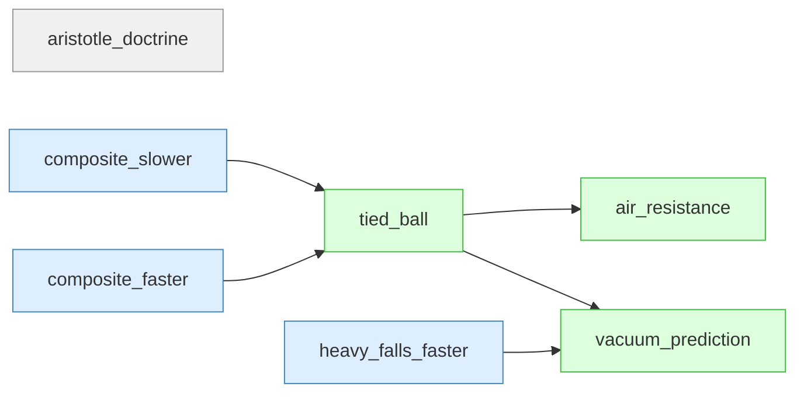
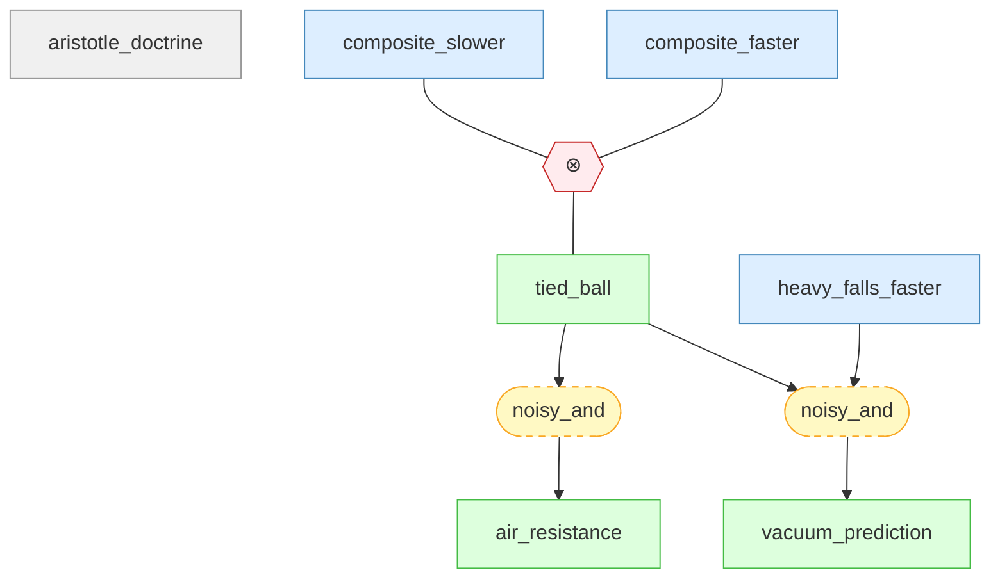

# galileo-falling-bodies-gaia

Galileo's falling bodies argument — Gaia knowledge package

## Overview

## Introduction

#### aristotle_doctrine ★

📋 `aristotle_doctrine`

> Aristotle's doctrine: heavier objects fall proportionally faster.

#### heavy_falls_faster ★

📌 `heavy_falls_faster`

> Observations show heavier stones fall faster than feathers.

#### composite_slower ★

📌 `composite_slower`

> The tied composite should be slower (light ball drags heavy ball).
>     $v_{\text{composite}} = \frac{m_1 v_1 + m_2 v_2}{m_1 + m_2}$

#### composite_faster ★

📌 `composite_faster`

> The composite has greater mass, so it should be faster.
>     $v_{\text{composite}} = k(m_1 + m_2) > k m_1$

#### tied_ball ★

📌 `tied_ball`

> not_both_true(composite_slower, composite_faster)

#### air_resistance ★

📌 `air_resistance`

> Observed speed differences are caused entirely by air resistance.

🔗 **noisy_and**([tied_ball](#tied_ball))

#### vacuum_prediction ★

📌 `vacuum_prediction`

> In a vacuum, objects of different mass fall at the same rate.
>     $g \approx 9.8 \text{ m/s}^2$, independent of mass.

🔗 **noisy_and**([tied_ball](#tied_ball), [heavy_falls_faster](#heavy_falls_faster))

## Knowledge Graph

## Knowledge Nodes

### Settings

#### aristotle_doctrine ★

📋 `aristotle_doctrine`

> Aristotle's doctrine: heavier objects fall proportionally faster.

### Claims

#### composite_faster ★

📌 `composite_faster`

> The composite has greater mass, so it should be faster.
>     $v_{\text{composite}} = k(m_1 + m_2) > k m_1$

#### composite_slower ★

📌 `composite_slower`

> The tied composite should be slower (light ball drags heavy ball).
>     $v_{\text{composite}} = \frac{m_1 v_1 + m_2 v_2}{m_1 + m_2}$

#### heavy_falls_faster ★

📌 `heavy_falls_faster`

> Observations show heavier stones fall faster than feathers.

#### tied_ball ★

📌 `tied_ball`

> not_both_true(composite_slower, composite_faster)

#### air_resistance ★

📌 `air_resistance`

> Observed speed differences are caused entirely by air resistance.

🔗 **noisy_and**([tied_ball](#tied_ball))

#### vacuum_prediction ★

📌 `vacuum_prediction`

> In a vacuum, objects of different mass fall at the same rate.
>     $g \approx 9.8 \text{ m/s}^2$, independent of mass.

🔗 **noisy_and**([tied_ball](#tied_ball), [heavy_falls_faster](#heavy_falls_faster))

